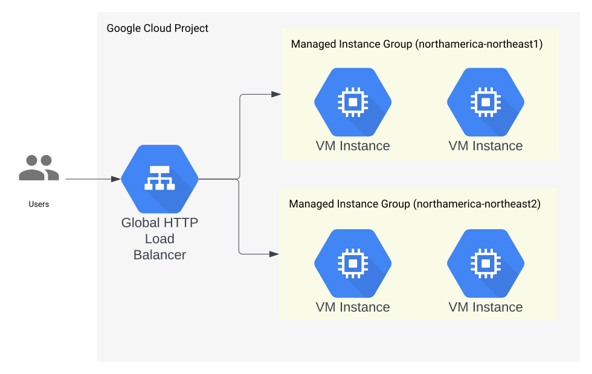

# Hello, World! - Express - Terraform - Managed Instance Groups

A [Hello, World!](https://en.wikipedia.org/wiki/%22Hello,_World!%22_program) [Express](https://expressjs.com/) application served from a [Docker Container](https://www.docker.com/resources/what-container/#:~:text=A%20Docker%20container%20image%20is,tools%2C%20system%20libraries%20and%20settings.) running in [Container-Optimized Virtual Machine instances](https://cloud.google.com/compute/docs/containers/deploying-containers) in [Managed instance groups](https://cloud.google.com/compute/docs/instance-groups#managed_instance_groups) behind a [Global HTTP Load Balancer](https://cloud.google.com/compute/docs/instance-groups/adding-an-instance-group-to-a-load-balancer).

Provisioned with [terraform](https://www.terraform.io/).

## Architecture

## Deployment

1. [Install terraform](https://developer.hashicorp.com/terraform/downloads).
1. [Install the gcloud CLI](https://cloud.google.com/sdk/docs/install).
1. [Create a Google Cloud project](https://cloud.google.com/resource-manager/docs/creating-managing-projects#creating_a_project).
1. Run [`gcloud auth login`](https://cloud.google.com/sdk/gcloud/reference/auth/login).
1. Run [`gcloud auth application-default login`](https://cloud.google.com/sdk/gcloud/reference/auth/application-default/login). 
1. `cd` into the [`terraform` folder](./infra/deployment/terraform/)
1. Run `cp terraform.tfvars.template terraform.tfvars` and fill out the variables with your own values.
1. Comment out the contents of the `backend.tf` file.
1. Run `terraform init`.
1. Run `terraform apply -target=module.enable_apis`.
1. Run `terraform apply`.

### (Optional) Use GCS backend for the terraform state.
1. Uncomment the contents of the `backend.tf` and set the `bucket` attribute to the value of the `tfstate_bucket` output.
1. Run `terraform init` and type `yes`.

## Running the Application

1. `cd` into the [`terraform` folder](./infra/deployment/terraform/)
1. Run `terraform output ip_address` to find the external IP address of the Global HTTP Load Balancer.
1. Run `curl "http://$(terraform output ip_address | tr -d '"')"`. You should see the response `{"message":"Hello, World!"}`. 